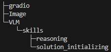

# Reasoning With Text and Image

## 0. Overview

### Quick Start

```bash
./start.sh
```

## 1. Architecture


## 2. Folder Structure



## 3. Models

### 3.1 T2I
    - 
    -
    -

### 3.2 VLM
    - 
    - 
    - 